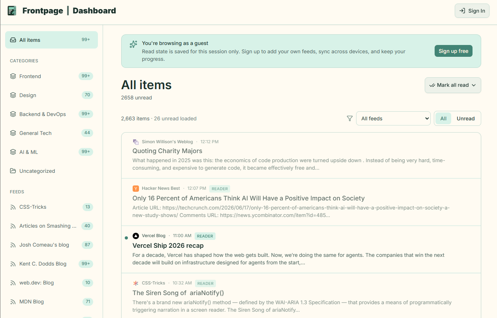
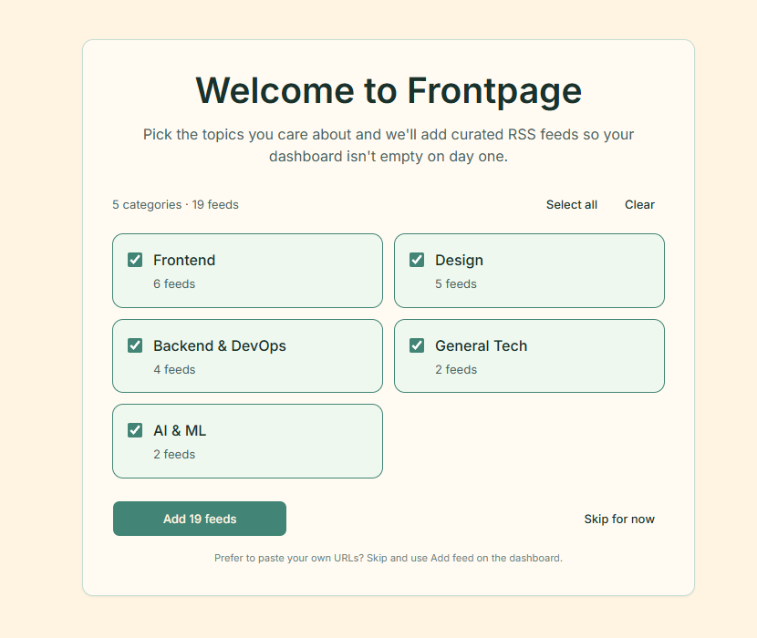
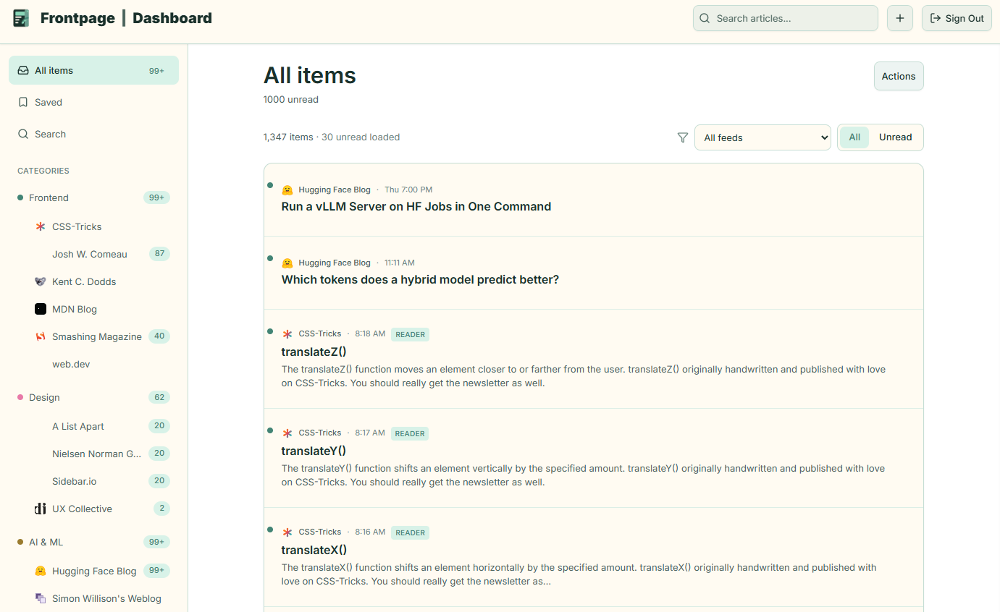

# Frontpage — RSS Feed Reader

A customizable RSS/Atom aggregator with a calm reading dashboard. Built as a [Frontend Mentor Product Challenge](https://www.frontendmentor.io).

| | URL |
|---|-----|
| **Live site** | https://frontpage-feed-reader-main-rho.vercel.app |
| **Guest demo** *(submit this for instant access)* | https://frontpage-feed-reader-main-rho.vercel.app/guest |

---

## For reviewers

You can evaluate the full UX **without creating an account** via guest mode. Sign up only if you want to test persistence, onboarding, search, and saved articles.

### Path A — Guest demo (~2 min, no signup)

1. Open **[`/guest`](https://frontpage-feed-reader-main-rho.vercel.app/guest)** — 19 live RSS feeds across 5 categories.
2. Click a **category** in the sidebar (desktop) or open the menu (mobile).
3. **Mark items read/unread** — state persists in `localStorage` for the session.
4. Open an article — in-app **reader** when `content_html` is available; otherwise opens the source site.
5. Visit **[`/`](https://frontpage-feed-reader-main-rho.vercel.app)** for the marketing landing (hero, features, how it works, footer).

### Path B — Authenticated flow (~5 min)

1. **[Sign up](https://frontpage-feed-reader-main-rho.vercel.app/signup)** with email + password.
2. **Onboarding** — pick starter categories (Frontend, Design, etc.) or skip to add feeds manually.
3. **Dashboard** — filter by category, infinite scroll, unread indicators. Use the **layout switcher** (Compact / Standard / Cards) above the feed list.
4. **Search** — header search or [`/search?q=react`](https://frontpage-feed-reader-main-rho.vercel.app/search?q=react); matches title + description with highlights.
5. **Saved** — bookmark from a list row or inside the reader → [`/saved`](https://frontpage-feed-reader-main-rho.vercel.app/saved).
6. **Feed management** — add/remove/refresh feeds; rename, reorder, or delete categories (sidebar ⋮ menus).

### Requirements coverage

| Spec area | Feature | Status | Try it |
|-----------|---------|--------|--------|
| **Core** | Auth (sign up, login, email verify) | ✅ | `/signup`, `/login` |
| **Core** | Subscribe to RSS/Atom feeds | ✅ | Onboarding or “Add feed” dialog |
| **Core** | Organize feeds by category | ✅ | Sidebar + category management |
| **Core** | Article list with read/unread | ✅ | `/dashboard`, `/category/[id]` |
| **Core** | In-app reader | ✅ | Click any item with full HTML content |
| **Core** | Responsive layout | ✅ | Resize viewport; mobile drawer nav |
| **Stretch** | Search across library | ✅ | `/search?q=…` |
| **Stretch** | Bookmarks / Saved | ✅ | Bookmark icon → `/saved` |
| **Stretch** | OPML import/export | ❌ | Not implemented |
| **Design Challenge** | Onboarding / content discovery | ✅ | New account → `/onboarding` |
| **Design Challenge** | Digest view | ❌ | Deferred |
| **Design Challenge** | Layout customization | ✅ | Layout switcher on dashboard, category, feed, search, and saved views |

---

## Screenshots

### Landing page

Marketing hero, feature grid, how-it-works steps, and footer. Scroll reveals use Intersection Observer + Framer Motion.



### Onboarding

First-time users with no feeds land here. Select curated starter packs by category, import in one step, or skip to manual setup.



### Dashboard

Dense list view with category sidebar, unread dots, and feed management. Sidebar collapses to icons on desktop.



> Guest dashboard (`/guest`) uses the same list/sidebar patterns with live-fetched sample feeds instead of Supabase data.

---

## Design decisions

**Dashboard** — Linear-inspired density: sticky sidebar, bold unread titles, small accent dots. List rows animate on filter changes when &lt; 50 items (`AnimatePresence` + `motion.li` as direct children).

**Reader** — Serif body (Georgia) on a calm background; HTML sanitized with lazy images. Bookmark control in the reader toolbar.

**Onboarding** — Dedicated route group without the app shell. Imports from `sample-feeds.json` via `addFeed` (max 4 concurrent). Skip sets a cookie so users aren’t redirected again.

**Layout customization** — Three global feed layouts (Compact / Standard / Cards) via a toolbar switcher. Preference stored in `profiles.layout` + `localStorage`. Cards show cover images from feed HTML when available; favicon gradient fallback otherwise. Global setting keeps the model simple; per-category layouts deferred.

**Guest mode** — Server-fetched live RSS (5‑min cache) so reviewers see real articles, not static placeholders. Read state in `localStorage`.

**Landing** — Section backgrounds blend with `mask-image` fades (same technique as the hero gradient). Product screenshot uses `next/image` with responsive `sizes`.

---

## Tech stack

Next.js 15 (App Router) · Supabase (Postgres + Auth + RLS) · Vercel · Tailwind CSS v4 · Framer Motion · `rss-parser` · `@tanstack/react-virtual`

---

## Performance

| Technique | Where |
|-----------|--------|
| Route-level Suspense + skeletons | Dashboard, guest hydration, load-more |
| Virtualized lists | 50+ items (`@tanstack/react-virtual`) |
| Cursor pagination | 30 items/page + infinite scroll |
| Lazy images | Favicons, reader HTML, marketing assets |
| Guest RSS cache | 5-minute in-memory TTL |
| Image formats | AVIF/WebP via `next.config.ts` |

### Lighthouse (production, mobile)

| Page | Perf | A11y | Best | SEO |
|------|------|------|------|-----|
| `/` | **98** | **94** | **100** | **100** |
| `/guest` | **97** | **79**\* | **96** | **73** |

\*Guest a11y is lower because live RSS aggregation slows the SSR audit window — intentional trade-off for an authentic demo.

---

## Known limitations

- OPML import/export not built
- No background cron for feed refresh (manual refresh per feed)
- Search uses `ilike` (sufficient for personal libraries)
- List exit animations disabled when virtualized (50+ items)
- Digest view not started
- Card layout does not virtualize long lists (use Compact for 100+ items)
- Optional polish: keyboard shortcuts, dark mode, PWA

---

## Run locally

```bash
git clone https://github.com/alexisdlr/frontpage-rss.git
cd frontpage-rss
pnpm install
cp .env.example .env.local   # Supabase URL + publishable key
pnpm dev
```

Open [http://localhost:3000](http://localhost:3000). **Guest mode works without env vars.** Auth, dashboard, search, saved, and onboarding need Supabase credentials.

| Variable | Description |
|----------|-------------|
| `NEXT_PUBLIC_SUPABASE_URL` | Supabase project URL |
| `NEXT_PUBLIC_SUPABASE_PUBLISHABLE_KEY` | Supabase anon/publishable key |

---

## Acknowledgments

Built as a [Frontend Mentor Product Challenge](https://www.frontendmentor.io). Spec and brand guidance from the challenge starter kit.
